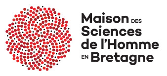
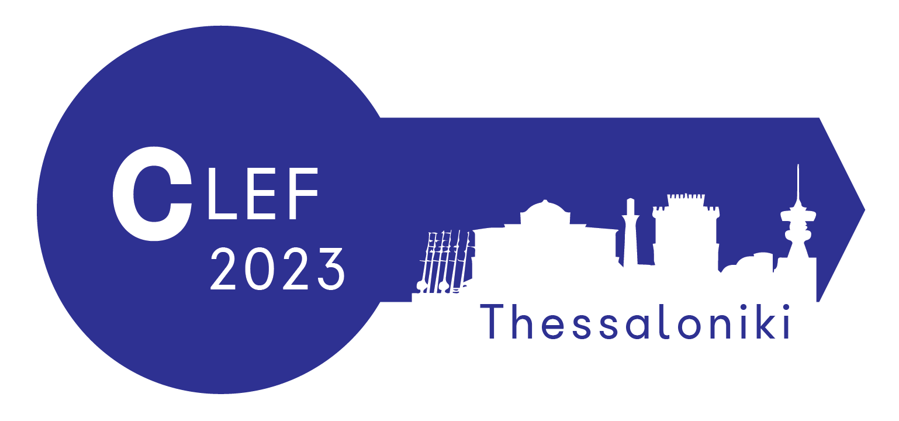

# JOKER
<p align="center">
  
</p>

 Accueil | [Tâches](https://www.joker-project.com/clef-2023/tasks) | [Programme CLEF](program) | [Publications](publications) | [Partenaires](partners) | [Concours](contest) | [Contacts](contact) | [Outils](tools) | [CLEF 2022](https://www.joker-project.com/clef-2022/EN/project)
<br>

<br>
  <h1 align="center">CLEF 2023 JOKER :</h1>
  <h2 align="center">Analyse Automatique des Jeux de mots</h2> 

### Thème et objectifs
L'humour reste l'un des aspects les plus difficiles de la communication interculturelle. Comprendre l'humour implique souvent de comprendre des références culturelles implicites et/ou des doubles sens, en particulier dans le cas des jeux de mots, ce qui soulève non seulement la question de sa traduisibilité même, mais aussi celle de la détection et de la classification des instances de ce phénomène complexe. L'objectif du projet JOKER est de réunir des linguistes, des traducteurs et des informaticiens afin de créer des collections de tests réutilisables pour l'évaluation comparative et d'explorer de nouvelles mesures d'évaluation afin d'encourager les travaux sur les méthodes automatiques d'interprétation, de génération et de traduction des jeux de mots. 

### Pertinence pour CLEF et importance pour le domaine
JOKER se situe à l'intersection de plusieurs domaines, notamment le traitement du langage naturel, la traduction automatique (TA) et l'interaction homme-machine, ainsi que la linguistique, la philosophie et la psychologie. Dans l'édition 2022, nous nous sommes concentrés sur la traduction automatique et nous avons construit un corpus parallèle anglais-français unique de jeux de mots avec 5 000 jeux de mots parallèles d'une ligne et 1 500 instances parallèles de jeux de mots dans des entités nommées. Nous avons également observé des exécutions basées sur notre corpus pour une tâche non partagée de génération de jeux de mots afin d'améliorer l'engagement de l'interlocuteur dans les systèmes de dialogue. Les récents développements en matière d'apprentissage automatique et d'intelligence artificielle ont considérablement amélioré la qualité de la TA, mais les jeux de mots sont souvent considérés comme intraduisibles, en particulier par la TA statistique ou neuronale [1], [2], qui ne peut pas traiter de manière efficace les textes qui ignorent ou subvertissent délibérément les conventions linguistiques [3].
<br>
Il existe quelques corpus monolingues sur l'humour, notamment les ensembles de données créés pour les tâches partagées de l'atelier international sur l'évaluation sémantique (SemEval) : #HashtagWars: Learning a Sense of Humor [4], Detection and Interpretation of English Puns [3], Assessing Humor in Edited News Headlines [5], et Hackathon : Detecting and Rating Humor and Offense [6].  Mihalcea et al [7] ont recueilli 16 000 phrases humoristiques et un nombre égal d'échantillons négatifs à partir de titres de journaux, de proverbes, du British National Corpus et de l'ensemble de données Open Mind Common-Sense. Un autre ensemble de données contient 2 400 jeux de mots et non jeux de mots provenant de sources d'information, de Yahoo!Answers et de proverbes [8], [9]. La plupart des ensembles de données sont en anglais, avec quelques exceptions notables en italien [10], en russe [11], [12] et en espagnol [13]. À notre connaissance, le corpus que nous avons construit dans le cadre de la tâche JOKER 3 [14], [15] est le premier à détecter les jeux de mots en français.


### Scénarios d'utilisation et domaines d'application
Le jeu de mots est un élément récurrent de la littérature, de la publicité, des films et des conversations sociales.  Il est donc essentiel que les applications de traitement du langage naturel opérant sur ces types de discours soient capables de reconnaître et de traiter de manière appropriée les cas de jeux de mots [14]. Comme nous l'avons mentionné précédemment, la préservation des jeux de mots dans la traduction peut être cruciale pour comprendre l'aspect humoristique d'un signifiant. La traduction automatique des jeux de mots est donc particulièrement importante pour le sous-titrage. Comme nous l'avons démontré précédemment [15], la traduction automatique (y compris les moteurs populaires tels que DeepL<a href="#note1" id="note1ref"><sup>1</sup></a>) ne réussit que dans 13 % des cas. Bien qu'il soit impossible de résoudre un problème aussi complexe en une seule fois, nous avons identifié trois étapes principales qui pourraient nous rapprocher de l'automatisation de l'analyse des jeux de mots, à savoir la détection des jeux de mots, leur interprétation et leur traduction. La détection et l'interprétation des jeux de mots sont également importantes dans les systèmes de dialogue afin de permettre à un agent virtuel de réagir correctement aux indications de l'interlocuteur. 
<br>

### Références
[1]	H. Ardi, M. A. Hafizh, I. Rezqi, and R. Tuzzikriah, “Can Machine Translations Translate Humorous Texts?”, Humanus, 2022, doi: 10.24036/humanus.v21i1.115698.<br>
[2]	F. Regattin, "Traduction automatique et jeux de mots : l’incursion (ludique) d’un inculte". Brest, Université de Bretagne occidentale, mars 2021. [URL](https://motsmachines.github.io/2021/en/submissions/Mots-Machines-2021_paper_5.pdf)<br>
[3]	T. Miller, "The Punster’s Amanuensis: The Proper Place of Humans and Machines in the Translation of Wordplay", in Proceedings of the Second Workshop on Human-Informed Translation and Interpreting Technology (HiT-IT 2019), sept. 2019, p. 57‑64. doi: 10.26615/issn.2683-0078.2019_007.<br>
[4]	P. Potash, A. Romanov, and A. Rumshisky, " SemEval-2017 Task 6: #HashtagWars: Learning a Sense of Humor ", in Proceedings of the 11th International Workshop on Semantic Evaluation, août 2017, p. 49‑57. doi: 10.18653/v1/S17-2004.<br>
[5]	N. Hossain, J. Krumm, M. Gamon, and H. Kautz, " SemEval-2020 Task 7: Assessing Humor in Edited News Headlines ", in Proceedings of the Fourteenth Workshop on Semantic Evaluation, déc. 2020, p. 746‑758. [En ligne]. Disponible sur: [https://aclanthology.org/2020.semeval-1.98](https://aclanthology.org/2020.semeval-1.98)<br>
[6]	J. A. Meaney, S. Wilson, L. Chiruzzo, A. Lopez, and W. Magdy, " SemEval-2021 Task 7: HaHackathon, Detecting and Rating Humor and Offense ", in Proceedings of the 15th International Workshop on Semantic Evaluation, août 2021, p. 105‑119. doi: 10.18653/v1/2021.semeval-1.9.<br>
[7]	R. Mihalcea and C. Strapparava, " Making Computers Laugh: Investigations in Automatic Humor Recognition ", in Proceedings of Human Language Technology Conference and Conference on Empirical Methods in Natural Language Processing, Vancouver, British Columbia, Canada, oct. 2005, p. 531‑538. [En ligne]. Disponible sur: [https://www.aclweb.org/anthology/H05-1067](https://www.aclweb.org/anthology/H05-1067) <br>
[8]	A. Cattle and X. Ma, " Recognizing Humour using Word Associations and Humour Anchor Extraction ", in Proceedings of the 27th International Conference on Computational Linguistics, Santa Fe, New Mexico, USA, août 2018, p. 1849‑1858. [En ligne]. Disponible sur: [https://www.aclweb.org/anthology/C18-1157](https://www.aclweb.org/anthology/C18-1157)<br>
[9]	D. Yang, A. Lavie, C. Dyer, and E. Hovy, " Humor Recognition and Humor Anchor Extraction ", in Proceedings of the 2015 Conference on Empirical Methods in Natural Language Processing, Lisbon, Portugal, sept. 2015, p. 2367‑2376. doi: 10.18653/v1/D15-1284.<br>
[10]	A. Reyes, D. Buscaldi, and P. Rosso, " An Analysis of the Impact of Ambiguity on Automatic Humour Recognition ", in Text, Speech and Dialogue, Berlin, Heidelberg, 2009, p. 162‑169. doi: 10.1007/978-3-642-04208-9_25.<br>
[11]	V. Blinov, V. Bolotova-Baranova, and P. Braslavski, "Large Dataset and Language Model Fun-Tuning for Humor Recognition", in Proceedings of the 57th Annual Meeting of the Association for Computational Linguistics, Florence, Italy, 2019, p. 4027‑4032. doi: 10.18653/v1/P19-1394.<br>
[12]	A. Ermilov, N. Murashkina, V. Goryacheva, and P. Braslavski, "Stierlitz Meets SVM: Humor Detection in Russian", in Artificial Intelligence and Natural Language, Cham, 2018, p. 178‑184. doi: 10.1007/978-3-030-01204-5_17.<br>
[13]	S. Castro, L. Chiruzzo, A. Rosá, D. Garat, and G. Moncecchi, "A Crowd-Annotated Spanish Corpus for Humor Analysis", in Proceedings of the Sixth International Workshop on Natural Language Processing for Social Media, Melbourne, Australia, juill. 2018, p. 7‑11. doi: 10.18653/v1/W18-3502.<br>
[14]	L. Ermakova et. al., "CLEF Workshop JOKER: Automatic Wordplay and Humour Translation", in Advances in Information Retrieval, vol. 13186, M. Hagen, S. Verberne, C. Macdonald, C. Seifert, K. Balog, K. Nørvåg, et V. Setty, Éd. Cham: Springer International Publishing, 2022, p. 355‑363. doi: 10.1007/978-3-030-99739-7_45.<br>
[15]	L. Ermakova et al., "Overview of the CLEF 2022 JOKER Task 3: Pun Translation from English into French", in Proceedings of the Working Notes of CLEF 2022: Conference and Labs of the Evaluation Forum, 2022.<br><br><br>
<a id="note1" href="#note1ref"><sup>1</sup></a>: *DeepL translator. Accessed on 17th July 2022. [URL](https://www.deepl.com/translator)*

## Comment citer
Si vous souhaitez approfondir ou utiliser ce travail, veuillez citer le [document](https://link.springer.com/chapter/10.1007/978-3-031-13643-6_27) dans lequel il est présenté :
```
Liana Ermakova, Tristan Miller, Fabio Regattin, Anne-Gwenn Bosser, Claudine Borg, Élise Mathurin, Gaëlle Le Corre, 
Sílvia Araújo, Radia Hannachi, Julien Boccou, Albin Digue, Aurianne Damoy & Benoît Jeanjean, 2022. 
Overview of JOKER@ CLEF 2022: Automatic Wordplay and Humour Translation workshop. 
In International Conference of the Cross-Language Evaluation Forum for European Languages (pp. 447-469). Springer, Cham.
```
[Paper](https://link.springer.com/chapter/10.1007/978-3-031-13643-6_27)

[Dowload .BIB](../clef-2022/BibTex/joker-clef-2022.bib)


<p>
<em>Ce projet a reçu une subvention gouvernementale gérée par l'Agence Nationale de la Recherche dans le cadre du programme « Investissements d'avenir » intégré à France 2030, avec la référence ANR-19-GURE-0001.</em>
</p>
<p>
<em>JOKER est soutenu par l'Institut des Sciences Humaines de Bretagne (MSHB).</em>
</p>
<div align="center">
  <a href="https://www.mshb.fr"></a>
  <a href="https://sea-eu.org/?lang=fr"></a>
  <a href="https://www.gouvernement.fr/le-programme-d-investissements-d-avenir"></a>
</div>
<br />
<div align="center">
  <a href="https://clef2022.clef-initiative.eu/index.php"></a> 
</div>

