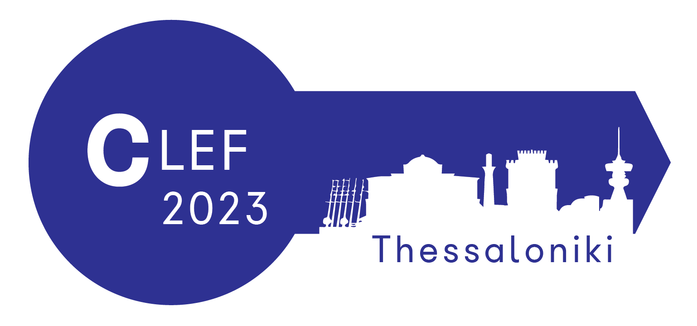

# JOKER

  

[Accueil](index) | [Tâches](https://www.joker-project.com/clef-2023/tasks) | [Programme CLEF](program) | [Publications](publications) | Partenaires | [Contest](contest) | [Contacts](contact) | [Outils](tools) | [CLEF 2022](https://www.joker-project.com/clef-2022/EN/project) 
 

## Direction : 
* **Liana Ermakova (Université de Bretagne Occidentale, Brest, France)**
 Professeure agrégée en informatique
 HCTI, Université de Bretagne Occidentale, Brest, France
 [Lien vers le profil](https://www.univ-brest.fr/hcti/menu/Membres/Enseignants-chercheurs/Ermakova--Liana)
 *Directrice du projet, Présidence générale*

* **Tristan Miller (Austrian Research Institute for Artificial Intelligence, Austria)**
 Groupe des technologies du langage et de l'interaction à l'OFAI
 [Lien vers le profil](https://logological.org/) 
 *Direction de JOKER@CLEF*

* **Adam Jatowt (University of Innsbruck, Austria)**
 Professeur titulaire au département d'informatique et au Digital Science Center
 [Lien vers le profil](https://adammo12.github.io/adamjatowt/)
 *Direction de JOKER@CLEF*

* **Anne-Gwenn Bosser (ENIB, Brest, France)**
 Professeure agrégée en informatique
 Lab-STICC (CNRS UMR 6285), Responsable de l'équipe COMMEDIA
 [Lien vers le profil](https://labsticc.fr/en/directory/bosser-anne-gwenn)
 *Direction de JOKER@CLEF*

* **Victor Manuel Palma Preciado (Instituto Politécnico Nacional, Mexico / Université de Bretagne Occidentale, Brest, France)**
 Doctorant en informatique
 *Direction de JOKER@CLEF*

* **Grigori Sidorov (Instituto Politécnico Nacional, Mexico)**
 Professeur titulaire
 [Lien vers le profil](https://www.cic.ipn.mx/~sidorov/)
 *Direction de JOKER@CLEF*

## Autres organisateurs : 

* **Fabio Regattin (Università degli Studi di Udine, Italy)**
 Professeur agrégé en traduction du français vers l'italien
 Département des langues et des littératures, de la communication, de l'éducation et de la société
 [Lien vers le profil](https://people.uniud.it/page/fabio.regattin)
 *Participant*

* **Sílvia Araújo (University of Minho, Portugal)**
 Professeur agrégé en linguistique de corpus, technologies appliquées aux langues et humanités numériques
 Département des sciences humaines et sociales
 [Lien vers le profil](http://cehum.ilch.uminho.pt/researchers/25)
 *Participant*

* **Radia Hannachi (Université de Bretagne Sud, Lorient, France)**
 Maître de conférences en linguistique française et didactique du français langue étrangère
 HCTI, Faculté des arts, des lettres et des sciences sociales, « Département Ingénierie du Document »
 *Participant*

* **Élise Mathurin (Université de Bretagne Occidentale, Brest, France)**
 Chargé de cours en linguistique anglaise, responsable des étudiants de première année du master Rédaction technique/Traduction technique.
 HCTI, UFR ALL SHS, Département d'anglais
 [Lien vers le profil](https://www.univ-brest.fr/hcti/menu/Membres/Enseignants-chercheurs/Mathurin--Elise)
 *Participant*

* **Mohamed Saki (Université de Bretagne Occidentale, Brest, France)**
 Chargé de cours en linguistique anglaise
 HCTI, Département des sciences humaines et sociales
 [Lien vers le profil](https://www.univ-brest.fr/hcti/menu/Membres/Enseignants-chercheurs/Saki--Mohamed)
 *Participant*

* **Benoît Jeanjean (Université de Bretagne Occidentale, Brest, France)**
 Professeur de latin
 HCTI, Département des sciences humaines et sociales
 [Lien vers le profil](https://www.univ-brest.fr/hcti/menu/Membres/Enseignants-chercheurs/Jeanjean__Benoit)
 *Participant*

* **Gaëlle Le Corre (Université de Bretagne Occidentale, Brest, France)**
 Chargé de cours en linguistique anglaise
 EA 4451 CRBC, UFR ALL SHS, Département d'anglais
 [Lien vers le profil](https://www.univ-brest.fr/crbc/menu/Membres+du+laboratoire/Enseignants-chercheurs/Ga-lle-Le-Corre)
 *Participant*

* **Nathalie Narvaez (Université de Bretagne Occidentale, Brest, France)**
 Chargé de cours en linguistique anglaise
 HCTI, Département des sciences humaines et sociales
 [Lien vers le profil](https://www.univ-brest.fr/hcti/menu/Membres/Membres_associes/Narvaez--Nathalie)
 *Participant*

## Partenaires des universités SEA-UE : 

* **Leopoldo Gutierrez (University of Cadiz, Spain)**
 Professeur agrégé
 Département des médias et de la communication, Faculté des médias et des sciences de la connaissance
 [Lien vers le profil](blablabla)
 *Coordinateur des universités partenaires*

* **Khatima El Krirh (University of Cadiz, Spain)**
 *Participant*

* **Rachel Kinlay (University of Cadiz, Spain)**
 *Participant*

* **Claudine Borg (University of Malta)**
 Professeure agrégée
 Études de traduction, de terminologie et d'interprétation Faculté des lettres
 [LLien vers le profil](https://www.um.edu.mt/profile/claudineborg)
 *Coordinatrice de l'université partenaire, spécialiste de la traduction*

* **Ġorġ Mallia (University of Malta)**
 Professeur agrégé
 Département des médias et de la communication, Faculté des médias et des sciences de la connaissance
 [Lien vers le profil](https://www.um.edu.mt/profile/gorgmallia)
 *Participant, specialiste de l'humour*

* **Monika Bokiniec (University of Gdansk)** 
 Professeure agrégée
 Département d'esthétique et de philosophie de la culture, Faculté des sciences sociales
 [Lien vers le profil](https://ug.edu.pl/pracownik/413/monika_bokiniec)
 *Coordinatrice de l'université partenaire*

* **Gordan Matas (University of Split)**
 Professeur agrégé
 Département des langues et de la littérature anglaise
 [Lien vers le profil](https://www.ffst.unist.hr/gordan.matas)
 *Coordinateur de l'université partenaire*

* **Danica Škara (University of Split)**
 Professeure émérite
 Département d'anglais, Faculté de philosophie
 [Lien vers le profil](https://www.researchgate.net/profile/Danica-Skara)
 *Participante*

## Maintenance du site web :
* **Adèle Gigon**, Université de Bretagne Occidentale, Brest, France
* **Axele Le Breton**, Université de Bretagne Occidentale, Brest, France
* **Aurianne Damoy**, Université de Bretagne Occidentale, Brest, France
* **Angélique Robert**, Université de Bretagne Occidentale, Brest, France

 

   
 
       
 
   
 
     

<em>Ce projet a reçu une subvention gouvernementale gérée par l'Agence Nationale de la Recherche dans le cadre du programme « Investissements d'avenir » intégré à France 2030, avec la référence ANR-19-GURE-0001.</em>

<em>JOKER est soutenu par l'Institut des Sciences Humaines de Bretagne (MSHB).</em>

  
  
  

 

   

