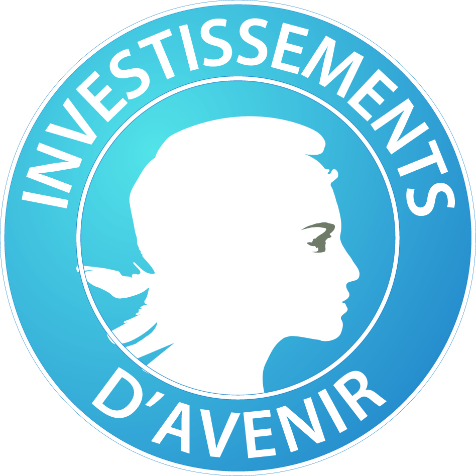

# JokeR

  

[Home](index)  | [CLEF program](program) | [Publications](publications) | Partners | [Contest](contest) | [Contact Us](contact) | [Tools](tools) | [CLEF 2022](https://www.joker-project.com/clef-2022/EN/project) 
 

## Organizers: 
* **Liana Ermakova (UBO)**
 IT Lecturer
 HCTI EA-4249, Department of Humanities and Social Sciences
 [Link to profile](https://www.univ-brest.fr/hcti/menu/Membres/Enseignants-chercheurs/Ermakova--Liana)
 *Project Leader*

* **Benoît Jeanjean (UBO)**
 Latin Professor
 HCTI EA-4249, Department of Humanities and Social Sciences
 [Link to profile](https://www.univ-brest.fr/hcti/menu/Membres/Enseignants-chercheurs/Jeanjean__Benoit)
 *Participant*

* **Gaëlle Le Corre (UBO)** 
 English Linguistics Lecturer
 EA 4451 CRBC, UFR ALL SHS, Department of English
 [Link to profile](https://www.univ-brest.fr/crbc/menu/Membres+du+laboratoire/Enseignants-chercheurs/Ga-lle-Le-Corre)
 *Participant*

* **Élise Mathurin (UBO)**
 English Linguistics Lecturer, in charge of the first-year students of the Technical Writing/Technical Translation master's degree.
 HCTI EA-4249, UFR ALL SHS, Department of English
 [Link to profile](https://www.univ-brest.fr/hcti/menu/Membres/Enseignants-chercheurs/Mathurin--Elise)
 *Participant*

* **Mohamed Saki (UBO)**
 English Linguistics Lecturer
 HCTI EA-4249, Department of Humanities and Social Sciences
 [Link to profile](https://www.univ-brest.fr/hcti/menu/Membres/Enseignants-chercheurs/Saki--Mohamed)
 *Participant*

* **Radia Hannachi (UBS)** 
 French Linguistics and French as a Foreign Language Didactics Lecturer
 HCTI EA-4249, Faculty of Arts, Humanities and Social Sciences, "Département Ingénierie du Document"
 *Participant*

* **Anne-Gwenn Bosser (ENIB)**
 Associate Professor in Computational Sciences
 Lab-STICC (CNRS UMR 6285), Leader of the COMMEDIA Team
 [Link to profile](https://labsticc.fr/en/directory/bosser-anne-gwenn)
 *Participant*

* **Sílvia Araújo (University of Minho, Portugal)**
 Associate Professor in Corpus Linguistics, Technologies Applied to Languages and Digital Humanities
 Department of Humanities and Social Sciences
 [Link to profile](http://cehum.ilch.uminho.pt/researchers/25)
 *Participant*

* **Fabio Regattin (Università degli Studi di Udine, Italy)** 
 Associate Professor in French to Italian Translation
 Department of Language and Literature, Communication, Education and Society
 [Link to profile](https://people.uniud.it/page/fabio.regattin)
 *Participant*

* **Tristan Miller (Austrian Research Institute for Artificial Intelligence, Austria)**
 Language and Interaction Technologies Group at OFAI
 [Link to profile](https://logological.org/) 
 *Participant*

## Partners from the SEA-EU universities: 

* **Ġorġ Mallia (University of Malta)**
 Associate Professor
 Media & Communications department, Faculty of Media & Knowledge Sciences
 [Link to profile](https://www.um.edu.mt/profile/gorgmallia)
 *Partner university coordinator, specialist in humour*

* **Claudine Borg (University of Malta)**
 Associate Professor
 Translation, Terminology and Interpreting Studies Faculty of Arts
 [Link to profile](https://www.um.edu.mt/profile/claudineborg)
 *Participant, specialist in translation*

* **Monika Bokiniec (University of Gdansk)** 
 Associate Professor
 Department of Aesthetics and Philosophy of Culture, Faculty of Social Sciences
 [Link to profile](https://ug.edu.pl/pracownik/413/monika_bokiniec)
 *Partner university coordinator*

* **Gordan Matas (University of Split)**
 Associate Professor
 Department of Language and English Literature
 [Link to profile](https://www.ffst.unist.hr/gordan.matas)
 *Partner university coordinator*

* **Danica Škara (University of Split)**
 Professor Emeritus
 English department, Faculty of Philosophy
 [Link to profile](https://www.researchgate.net/profile/Danica-Skara)
 *Participant*

## Website maintenance:
* **Adrien Couaillet (UBO)**
 Technical Translation/Redaction Master's Degree's Student
 Department of English
 *Intern*

* **Ludivine Grégoire (UBO)**
 Technical Translation/Redaction Master's Degree's Student
 Department of English
 *Intern*

    
   
     
     

<em>This project has received a government grant managed by the National Research Agency under the program "Investissements d'avenir" with the Reference ANR-19-GURE-0001</em>

<em>JokeR is supported by The Human Science Institute in Brittany (MSHB)</em>

  
  
  

 

   

